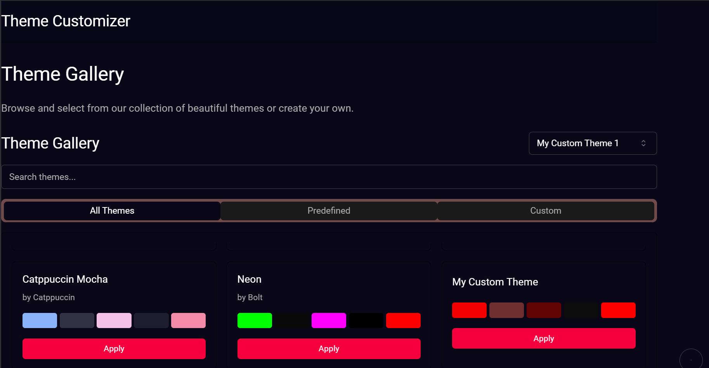
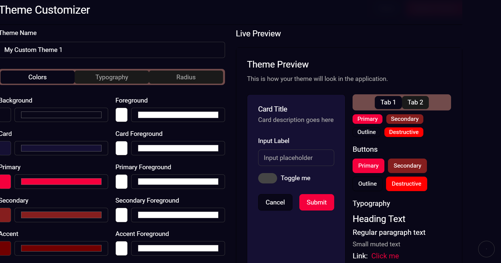

# Project Theme Customizer

Welcome to the Theme Customizer repository!

## Overview

The main goal of this project is that I have to make reusable theme selector/customizer for the enhanced user experience

## Features

- Can create custom theme on you own 
- Tried to add glowing theme
- Can easily customize theme

## Installation

To get started with follow these steps:

1. Clone the repository:
    ```bash
    git clone https://github.com/HemantRaj-2005/Custom-Theme-Maker.git
    ```
2. Navigate to the project directory:
    ```bash
    cd Custom-Theme-Maker
    ```
3. Install the dependencies:
    ```bash
    npm install
    ```

## Usage

To run the project, use the following command:
```bash
npm run dev
```

## Screenshots

Here are some screenshots of the project:




## Contact

For any questions or feedback, please contact Hemant Raj at coder.hemantraj05@gmail.com.
